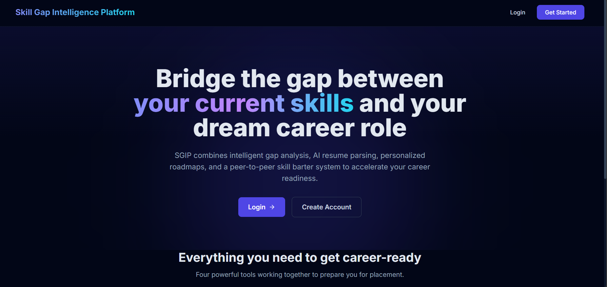
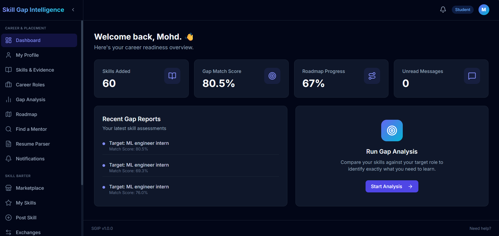
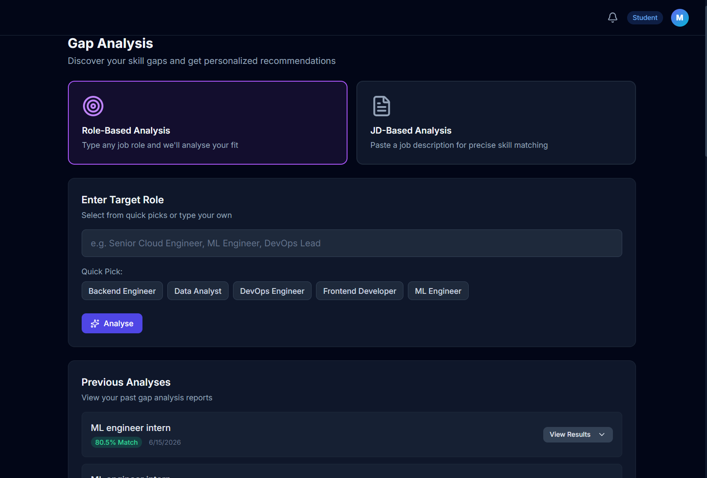
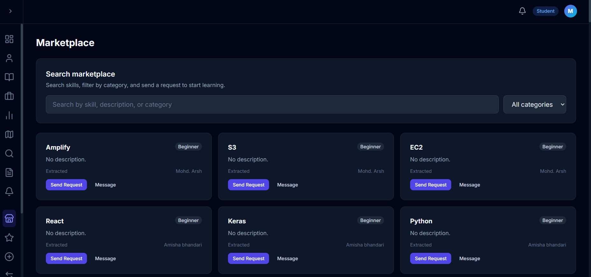

# Skill Gap Intelligence Platform (SGIP)

<p align="center">
  <h3 align="center">AI-powered career development platform with intelligent skill gap analysis, personalized roadmaps, and a collaborative skill marketplace.</h3>
</p>

<p align="center">
  <a href="https://sgip-pi.vercel.app">
    
  </a>
  &nbsp;
  <a href="https://sgip.onrender.com">
    
  </a>
  &nbsp;
  <a href="https://opensource.org/licenses/MIT">
    
  </a>
</p>
<p align="center">
  
  
  
</p>

## About SGIP
The Skill Gap Intelligence Platform (SGIP) is a comprehensive web application designed to bridge the gap between student capabilities and industry requirements. By leveraging AI-powered resume parsing and deterministic skill gap analysis, SGIP generates actionable, personalized learning roadmaps while fostering a collaborative skill-bartering marketplace.

## 📸 Project Preview

> Some Screenshots from the Platform.

### Landing Page
<p align="center">

</p>

### Student Dashboard
<p align="center">

</p>

### AI Gap Analysis
<p align="center">

</p>

### Skill Marketplace
<p align="center">

</p>

---

## Platform Metrics

| Metric | Count |
|--------|-------|
|  Gap Reports Generated | 30 |
|  Roadmaps Created | 13 |
|  Skills in Database | 121 |
|  Career Roles | 5 |
|  Average Compatibility Score | 48.4% |

*Stats fetched live from MongoDB at README generation time — June 26, 2026*

## Features

-  **AI Resume Parsing**: Extracts skills directly from user resumes using LLaMA 3.3.
-  **Gap Analysis (Role + JD mode)**: Calculates skill compatibility against predefined career roles or custom Job Descriptions.
-  **Fuzzy Skill Matching**: Deterministically matches overlapping user skills with industry requirements using Jaccard similarity.
-  **Personalized Roadmap**: Generates detailed, step-by-step learning roadmaps to acquire missing skills.
- **Mentor Discovery**: Connects students with experienced mentors for personalized guidance.
- **Evidence Review**: Allows students to submit proof of skill acquisition for mentor review and verification.
-  **4-Role RBAC**: Secure access controls divided between Student, Mentor, Placement Officer, and Admin.
-  **Audit Trail**: Immutable logging of all state-changing actions across the platform.
-  **Rate Limiting**: Defends endpoints against abuse with intelligent rate limiting.
-  **PII Redaction**: Scrubs Personally Identifiable Information before interacting with LLMs.

## Tech Stack

### Frontend


### Backend


### Database


### AI


### Cloud


### DevOps


## 🏗️ Architecture

```text
[Browser] 
   │
   └──► [Vercel (React Frontend)] 
              │
              └──► [Render (Express Backend)] 
                         ├──► [MongoDB Atlas (Database)]
                         ├──► [Cloudinary (Asset Storage)]
                         └──► [Groq API (LLM Inference)]
```

## 👥 User Roles

| Role | Access | Key Features |
|------|--------|--------------|
| **Student** | Marketplace, barter, evidence, gap analysis, roadmap, resume, profile | Explore skills, generate roadmaps, trade skills, and build portfolios. |
| **Mentor** | Evidence review, assigned students | Review student evidence, provide actionable feedback, guide career growth. |
| **Placement Officer** | Analytics and reporting | Monitor overall cohort progress and skill distributions. |
| **Admin** | User management, role catalog, audit logs, full access | System configuration, moderation, log monitoring, role management. |

## AI Pipeline

```text
Resume PDF ──► pdf2json ──► PII Redaction ──► Groq LLM (LLaMA 3.3) ──► Skill Array
                                                                         │
                                                                         ▼
                                                                  Fuzzy Gap Engine
                                                                         │
    Roadmap ◄── AI Explanation (LLaMA 3.1) ◄── Compatibility Score ◄─────┘
```

##  Security Features

- JWT authentication with 7-day expiry
- bcrypt password hashing (cost factor 10)
- Role-based access control (Student, Mentor, PlacementOfficer, Admin)
- Helmet.js security headers
- CORS restricted to allowed origins
- Rate limiting on auth routes (10 req / 15 min)
- Rate limiting on resume parser (4 req / hour)
- Rate limiting on gap analysis (10 req / hour)
- Rate limiting on evidence submission (10 req / hour)
- Immutable audit trail for all state-changing actions
- PII redaction before sending data to Groq API
- Prompt injection sanitization on user-supplied text
- File upload validation (MIME type + size limits)
- Cloudinary secure storage for user uploads
- isActive check on every authenticated request
- Password minimum: 8 characters, at least one letter and one number
- Ownership enforcement on all user-scoped resources

## Getting Started

### Prerequisites
- Node.js (v18+)
- MongoDB Atlas account (or local MongoDB)
- Groq API Key
- Cloudinary Account

### Installation

1. **Clone the repository:**
   ```bash
   git clone https://github.com/mohdarsh786/sgip.git
   cd sgip
   ```

2. **Install dependencies:**
   ```bash
   npm install          # Install root dependencies (concurrently)
   cd client && npm install
   cd ../server && npm install
   ```

3. **Environment Setup:**
   - Copy `server/.env.example` to `server/.env` and fill in:
     `MONGODB_URI`, `JWT_SECRET`, `GROQ_API_KEY`, `CLOUDINARY_URL`, etc.
   - Copy `client/.env.example` to `client/.env` and update the `VITE_API_URL`.

4. **Seed Database (Optional):**
   ```bash
   cd server
   npm run seed
   ```

5. **Run Development Servers:**
   ```bash
   # From the project root
   npm run dev
   ```

## 👨‍💻 Team

- **Mohd. Arsh** — [](https://github.com/mohdarsh786)
- **Mohd. Faiz** — [](https://github.com/mdfaizu8941)

## 📄 License

This project is licensed under the [MIT License](https://opensource.org/licenses/MIT).
